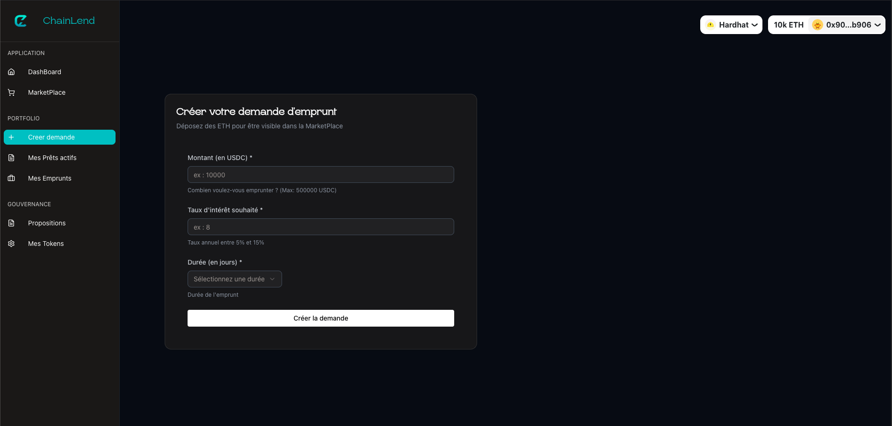
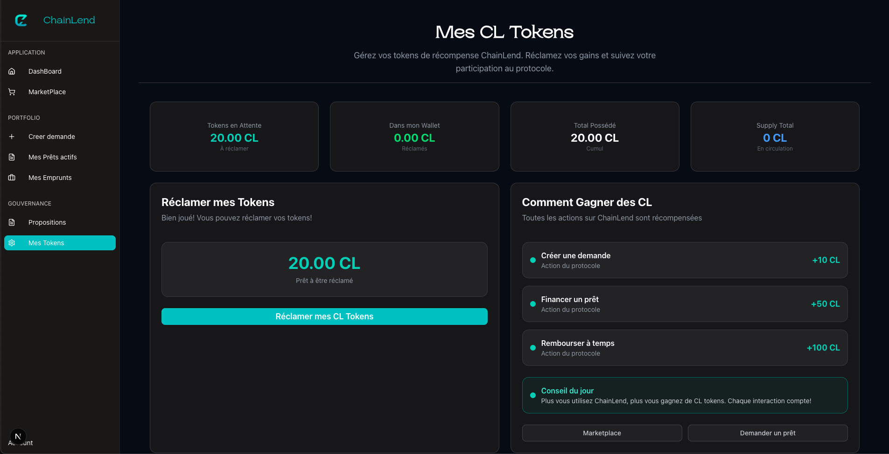
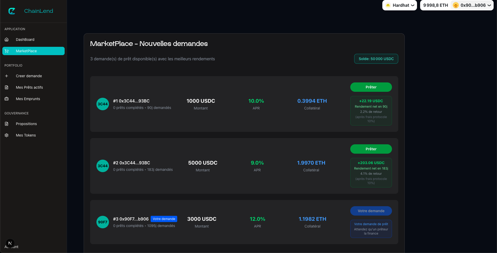
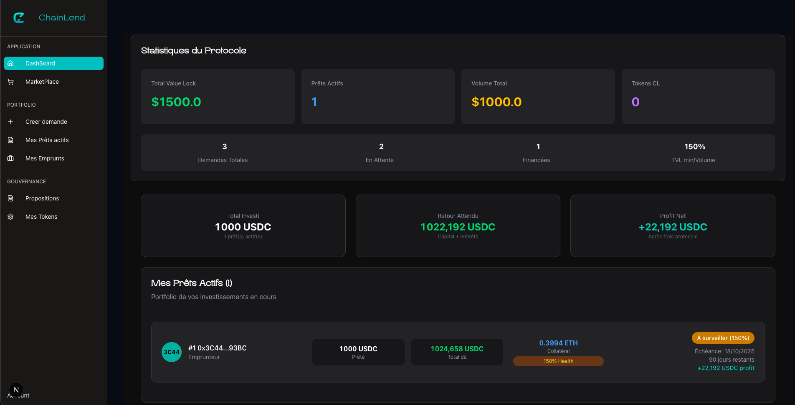
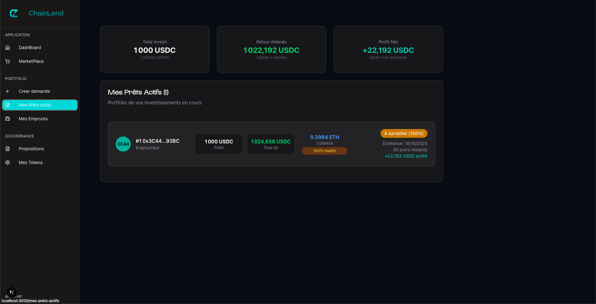
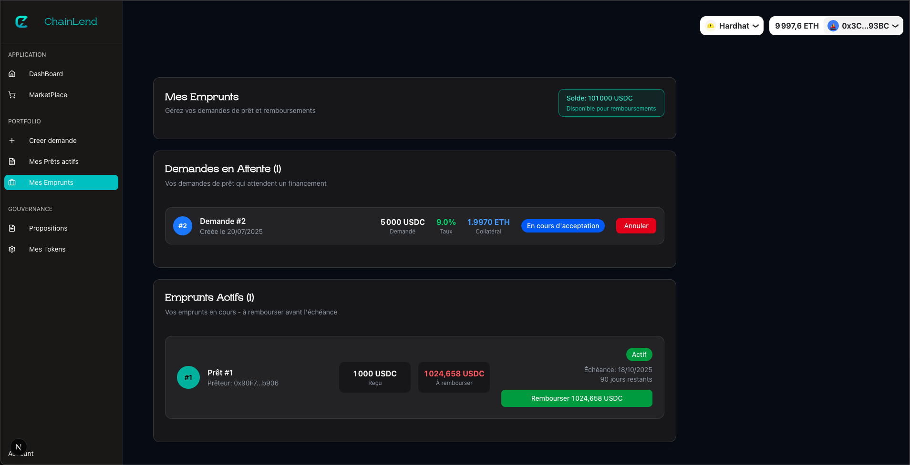

# 🏦 ChainLend - P2P Lending Protocol

A complete decentralized peer-to-peer lending application built on Base mainnet fork, featuring ETH collateral management and CL token rewards.

## Content 

- Screenshots
  - Create Loan Request
  - CL Token Rewards
  - Marketplace
  - Dashboard
  - Active Loans
  - Loan Management

- Features
  - Secure & Decentralized
  - Advanced Lending Features
  - CL Token Rewards System
  - Risk Management

- Architecture
  - Smart Contract Layer
  - Frontend Layer

- Tech Stack
  - Blockchain & Smart Contracts
  - Frontend & Web3 Integration
  - UI & Design
  - Development & Testing

- Quick Start
  - Prerequisites
  - Clone the Repository
  - Backend Setup
  - Environment Configuration
  - Start Base Mainnet Fork
  - Frontend Setup
  - Access the Application

- Usage Guide
  - For Borrowers
  - For Lenders
  - CL Token Benefits

- Smart Contract Details
  - Key Functions
  - Key Events
  - Security Features

- Testing
  - Comprehensive Test Suite
  - Test Categories
  - Coverage Breakdown

- Deployment
  - Smart Contract Deployment
  - Frontend Deployment

- Project Structure
- Roadmap
- Author

## 📸 Screenshots

### 🎯 Create Loan Request

Users can create loan requests with ETH collateral and competitive interest rates.



### 🏆 CL Token Rewards

Earn CL tokens for every protocol interaction - creating requests, funding loans, and repaying on time.



### 🏪 Marketplace

Browse and fund loan requests with transparent pricing and detailed analytics.



### 📊 Dashboard

Track your investments, protocol statistics, and portfolio performance.



### 💼 Active Loans

Monitor loan performance, health factors, and upcoming repayments.



### 🔧 Loan Management

Manage repayments, collateral, and loan lifecycle with ease.



## ✨ Features

### 🔐 Secure & Decentralized

- Smart contract built with OpenZeppelin standards and comprehensive testing
- Chainlink price feeds for real-time ETH/USD pricing with staleness protection
- 150% minimum collateralization ratio with health factor monitoring
- Gas optimized with custom errors and efficient storage patterns

### 💰 Advanced Lending Features

- Dynamic collateral management - add/withdraw excess collateral during loan lifecycle
- Flexible terms - interest rates from 5% to 15%, durations from 30 days to 3 years
- Real-time health monitoring - track collateral ratios and liquidation risk
- P2P marketplace - direct borrower-to-lender matching with transparent pricing

### 🏆 CL Token Rewards System

- Create Request: Earn 10 CL tokens for loan requests
- Fund Loans: Earn 50 CL tokens for providing liquidity
- Repay On-time: Earn 100 CL tokens for timely repayments
- Governance Ready: CL tokens designed for future protocol governance

### 🛡️ Risk Management

- Health factor monitoring with real-time collateral ratio tracking
- Warning system with early alerts when approaching liquidation threshold
- Protocol fees (10% on interest) for protocol sustainability
- Emergency controls with owner functions for critical situations

## 🏗️ Architecture

### Smart Contract Layer

**ChainLend.sol (Solidity 0.8.20)**
- OpenZeppelin Security (Ownable, ReentrancyGuard)
- Chainlink Price Feeds (ETH/USD, USDC/USD)
- Dynamic Collateral Management
- CL Token Rewards Integration
- Comprehensive Event System

### Frontend Layer

**Next.js 15.3.5 Application**
- RainbowKit Wallet Integration
- Wagmi React Hooks (Ethereum Interaction)
- Viem Client (Type-safe Ethereum APIs)
- Shadcn/UI Components (Modern Design)
- Real-time Price & Status Updates

## 🛠️ Tech Stack

### Blockchain & Smart Contracts

- **Solidity 0.8.20** - Smart contract development with latest features
- **Hardhat** - Development environment, testing, and deployment framework
- **OpenZeppelin** - Security-audited contract libraries
- **Chainlink** - Decentralized price feeds for ETH and USDC

### Frontend & Web3 Integration

- **Next.js 15.3.5** - React framework with App Router and React 19
- **Wagmi 2.15.6** - React hooks for Ethereum with TypeScript support
- **Viem 2.31.7** - TypeScript interface for Ethereum JSON-RPC
- **RainbowKit 2.2.8** - Best-in-class wallet connection experience

### UI & Design

- **Tailwind CSS 4.0** - Utility-first CSS framework
- **Shadcn/UI** - Beautifully designed React component library
- **Lucide React** - Consistent icon library
- **Next Themes** - Dark/light mode support

### Development & Testing

- **TypeScript** - Type safety across the entire stack
- **Hardhat Testing** - Comprehensive smart contract test suite
- **Base Mainnet Fork** - Real-world testing environment

## 🚀 Quick Start

### Prerequisites

- Node.js 18+ and npm
- Git for version control
- MetaMask or compatible Ethereum wallet

### 1️⃣ Clone the Repository

```bash
git clone https://github.com/Joh077/ChainLend.git
cd ChainLendV1
```

### 2️⃣ Backend Setup

```bash
cd backend
npm install
```

### 3️⃣ Environment Configuration

Create `.env` in the backend directory:

```env
INFURA_API_KEY=your_infura_api_key
PK=your_private_key
PRIVATE_KEY_BASE=your_base_private_key
ETHERSCAN=your_etherscan_api_key
```

### 4️⃣ Start Base Mainnet Fork

```bash
# Terminal 1 - Start the fork
anvil --fork-url https://mainnet.base.org --port 8545 --chain-id 31337

# Terminal 2 - Deploy contracts
npx hardhat ignition deploy ignition/modules/ChainLendBaseFork.js --network localhost --reset

# Setup test accounts with USDC
npx hardhat run scripts/SetupAccounts/SetupPresentation.js --network localhost
```

### 5️⃣ Frontend Setup

```bash
cd frontend
npm install

# Update contract addresses in constants/index.js with deployed addresses
# Start the development server
npm run dev
```

### 6️⃣ Access the Application

Open http://localhost:3000 and connect your wallet to start lending!

## 📖 Usage Guide

### For Borrowers

1. **Connect Wallet** - Use RainbowKit to connect your Ethereum wallet
2. **Create Loan Request** - Specify amount, interest rate, and duration
3. **Deposit Collateral** - Send ETH as collateral (minimum 150% ratio)
4. **Wait for Funding** - Lenders will review and fund your request
5. **Manage Loan** - Monitor health factor, repay on time
6. **Withdraw Collateral** - Retrieve your ETH after loan repayment

### For Lenders

1. **Browse Marketplace** - View available loan requests with detailed metrics
2. **Analyze Opportunities** - Check borrower history, collateral ratios, returns
3. **Fund Loans** - Approve USDC and fund attractive opportunities
4. **Monitor Performance** - Track loan status and upcoming repayments
5. **Earn Returns** - Receive principal + interest upon loan repayment

### CL Token Benefits

- **Governance Rights** - Vote on protocol upgrades and parameters (future)
- **Fee Sharing** - Earn protocol revenue share (future)
- **Staking Rewards** - Stake CL tokens for additional rewards (future)
- **Community Access** - Exclusive features and early access (future)

## 🔧 Smart Contract Details

### Key Functions

| Function | Access | Description |
|----------|---------|-------------|
| createLoanRequest() | Public | Create loan request with ETH collateral |
| fundLoan() | Public | Fund a pending loan request |
| repayLoan() | Borrower | Repay loan with interest |
| withdrawCollateral() | Borrower | Withdraw collateral after repayment |
| addCollateral() | Borrower | Add extra collateral to active loan |
| withdrawExcessCollateral() | Borrower | Withdraw surplus collateral |
| claimCLRewards() | Public | Claim accumulated CL tokens |

### Key Events

- LoanRequestCreated - New loan request with parameters
- LoanFunded - Loan successfully funded by lender
- LoanRepaid - Loan repaid with interest breakdown
- CollateralWithdrawn - Collateral returned to borrower
- CLRewardsEarned - CL tokens earned for actions

### Security Features

- Reentrancy protection on all state-changing functions
- Comprehensive input validation for all parameters
- Chainlink price feed staleness checks for security
- Custom errors for gas-efficient error handling
- Role-based access control with owner-only emergency functions

## 🧪 Testing

### Comprehensive Test Suite

```bash
cd backend
npm run test
```

**Test Results:**
- ✅ **212 Tests Passing** - Complete feature coverage
- ✅ **85.71% Code Coverage** - High confidence in contract security
- ✅ **60s Execution Time** - Fast feedback loop for development

### Test Categories

- **Core Functionality** - Loan creation, funding, repayment
- **Collateral Management** - Addition, withdrawal, liquidation protection
- **Access Control** - Permission validation and security
- **Edge Cases** - Boundary conditions and error scenarios
- **Integration Tests** - Full loan lifecycle on mainnet fork
- **Gas Optimization** - Gas usage validation

### Coverage Breakdown

- **ChainLend.sol** - 90.3% statements, 77.72% branches
- **CLToken.sol** - 57.89% statements (peripheral contract)
- **Interfaces** - 100% coverage

## 🚀 Deployment

### Smart Contract Deployment

```bash
# Compile contracts
npm run compile

# Deploy to local fork
npx hardhat ignition deploy ignition/modules/ChainLendBaseFork.js --network localhost

# For testnet deployment (future)
npx hardhat ignition deploy ignition/modules/ChainLendBaseFork.js --network sepolia --verify
```

### Frontend Deployment

The frontend runs locally to interact with the Base mainnet fork:

```bash
npm run build  # Build for production
npm start      # Start production server
```

## 📁 Project Structure

```
ChainLendV1/
├── backend/                 # Smart contracts & testing
│   ├── contracts/          # Solidity smart contracts
│   │   ├── ChainLend.sol      # Main lending protocol
│   │   ├── CLToken.sol        # Reward token contract
│   │   └── interfaces/        # Contract interfaces
│   ├── test/               # Comprehensive test suite
│   ├── scripts/           # Deployment & utility scripts
│   ├── ignition/          # Deployment modules
│   └── coverage/          # Test coverage reports
├── frontend/               # Next.js application
│   ├── app/               # Next.js 15 app router
│   ├── components/        # Reusable UI components
│   ├── constants/         # Contract ABIs & addresses
│   ├── hooks/             # Custom React hooks
│   └── public/            # Static assets
└── .github/               # CI/CD workflows
```

## 🗺️ Roadmap

### Phase 1: Core Protocol ✅

- [x] Basic lending functionality
- [x] Collateral management
- [x] CL token rewards
- [x] Comprehensive testing

### Phase 2: Enhanced Features 🚧

- [ ] **Liquidation System** - Automated liquidation for undercollateralized loans
- [ ] **WETH Integration** - Support WETH instead of native ETH for better UX
- [ ] **Multi-chain Support** - Deploy on Ethereum, Polygon, Arbitrum
- [ ] **Flash Loans** - Instant liquidity for arbitrage and refinancing

### Phase 3: Advanced DeFi 🔮

- [ ] **Governance System** - CL token voting on protocol parameters
- [ ] **Insurance Pool** - Community-funded insurance for lenders
- [ ] **Credit Scoring** - On-chain reputation system for borrowers
- [ ] **Yield Farming** - LP rewards for protocol liquidity providers


## 👨‍💻 Author

**Johan L** - *Blockchain Developer & DeFi Enthusiast*

- GitHub: @https://github.com/Joh077
- LinkedIn: Johan L
- Project: ChainLend